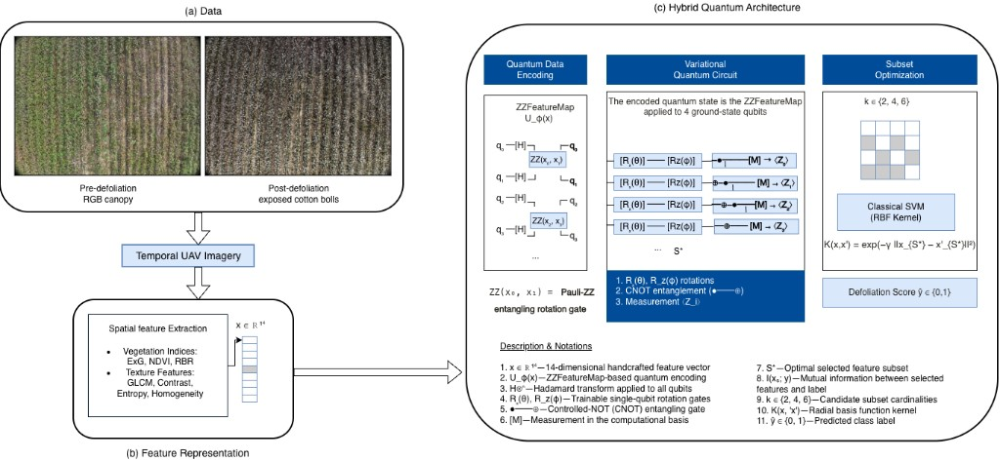

# Quantum Feature Selection for Cotton Defoliation Classification

A hybrid quantum-classical machine learning pipeline for optimal feature selection in agricultural UAV imagery analysis.

---

## Project Overview

This project demonstrates how quantum computing can be used to find better feature subsets for classifying cotton field images into pre-defoliation (green canopy) and post-defoliation (exposed cotton bolls) stages. Instead of using quantum ML for the entire pipeline, we use a practical hybrid approach where quantum circuits help select the most informative features, and classical ML handles the final classification.

---

## Frequently Asked Questions

### Q: What is the input data?

The input consists of 1,549 UAV (drone) images of cotton fields captured at two different stages:
- **Pre-defoliation**: 680 images showing green leafy canopy
- **Post-defoliation**: 869 images showing exposed white cotton bolls

From each image, we extract 14 handcrafted features:

| Category | Features | Description |
|----------|----------|-------------|
| Color (7) | Mean_ExG, Std_ExG | Excess Green vegetation index and its variation |
| | Mean_RBR | Red-Blue Ratio (distinguishes dry vs green material) |
| | Mean_NGRDI | Normalized Green-Red Difference Index |
| | Mean_R, Mean_G, Mean_B | Average RGB channel values |
| Texture (5) | Entropy | Information content / randomness |
| | Contrast, Homogeneity | GLCM texture measures |
| | Energy, Correlation | GLCM smoothness and linear dependencies |

---

### Q: What are we trying to achieve?

The goal is twofold:

1. **Binary classification**: Determine whether a UAV image shows pre- or post-defoliation cotton
2. **Feature selection**: Find the smallest subset of features (out of 14) that gives the best accuracy and noise robustness

Why not just use all 14 features? Because:
- Redundant features add noise and hurt generalization
- Fewer features mean faster inference and simpler models
- Finding truly complementary features improves robustness

---

### Q: Why use a hybrid quantum-classical approach?

Pure quantum approaches cannot efficiently search through all possible feature combinations due to exponential scaling. Here's the math:

If we wanted to find the best 4 features from 14 using only quantum methods:
- Number of possible subsets: C(14,4) = 1,001 combinations
- Each evaluation with a 14-qubit VQC takes ~20 minutes
- Total time: 1,001 × 20 min = **14 days**

The hybrid approach solves this:

```
Stage 1: Classical Pre-filter (instant)
    14 features → 6 candidates using Mutual Information
    
Stage 2: Quantum Wrapper Search (~5 minutes)
    Evaluate C(6,4) = 15 subsets using 4-qubit VQC
    
Stage 3: Classical SVM (instant)
    Train final classifier on selected features
```

Total time: ~5 minutes instead of 14 days.

---

### Q: Why exactly 4 qubits?

Each feature maps to one qubit through the ZZFeatureMap encoding. Four qubits is the sweet spot because:

| Qubits | State Vector Size | Memory | Simulation Speed |
|--------|-------------------|--------|------------------|
| 4 | 16 amplitudes | 256 bytes | ~1 ms per pass |
| 8 | 256 amplitudes | 4 KB | ~10 ms per pass |
| 14 | 16,384 amplitudes | 262 KB | ~500 ms per pass |
| 20 | 1 million amplitudes | 16 MB | ~minutes per pass |
| 30 | 1 billion amplitudes | 16 GB | impractical |

With 4 qubits:
- Simulation is trivially fast (2^4 = 16 complex numbers to track)
- Still expressive enough to capture pairwise feature interactions via ZZ entangling gates
- Can evaluate all 15 candidate subsets in under 5 minutes

---

### Q: Where is quantum ML used vs classical ML?

The pipeline has a clear division:

**Quantum ML (Feature Selection Phase)**
- ZZFeatureMap encodes 4 classical features into quantum states
- RealAmplitudes ansatz with trainable rotation gates
- CNOT gates create entanglement between qubits
- Measurements collapse to classification predictions
- COBYLA optimizer tunes the circuit parameters
- Built with Qiskit's VQC (Variational Quantum Classifier)

**Classical ML (Production Classification)**
- SVM with RBF kernel (C=10, gamma=scale)
- Takes the 4 quantum-selected features as input
- Handles the actual inference on new images
- Fast, deterministic, well-understood

**The Switch**: Once quantum selection identifies the best features [Std_ExG, Mean_RBR, Mean_B, Correlation], we train a classical SVM on just those 4 features. The quantum circuit's job is done—it found what to look for, not how to classify.

---

### Q: What system acts as the "black box" between QML and classical ML?

The VQC (Variational Quantum Classifier) is the black box. It's actually hybrid internally:

```
VQC Internal Structure:
┌─────────────────────────────────────────────────────┐
│  QUANTUM PART (runs on simulator)                   │
│  ─────────────────────────────────                  │
│  1. ZZFeatureMap: x ∈ ℝ⁴ → quantum state           │
│     - Hadamard gates on all qubits                  │
│     - ZZ(xᵢ, xⱼ) entangling rotations              │
│                                                     │
│  2. RealAmplitudes Ansatz:                          │
│     - Ry(θ) single-qubit rotations                  │
│     - CNOT entanglement layer                       │
│     - Trainable parameters θ                        │
│                                                     │
│  3. Measurement: collapse to |0⟩ or |1⟩            │
├─────────────────────────────────────────────────────┤
│  CLASSICAL PART                                     │
│  ─────────────────────────────────                  │
│  COBYLA optimizer adjusts θ to minimize loss        │
│  (runs on CPU, talks to quantum circuit)            │
└─────────────────────────────────────────────────────┘
```

The VQC returns an accuracy score for each feature subset. We pick the subset with the highest score, then hand those features to a classical SVM.

---

### Q: How does qubit simulation work in Qiskit? What's the memory usage?

Qiskit's StatevectorSampler simulates quantum circuits by tracking the full quantum state as a vector of complex numbers. Memory scales exponentially:

**Memory Formula**: `2^n × 16 bytes` (where n = number of qubits, 16 bytes per complex128)

For our 4-qubit VQC:
```
Statevector:           2^4 × 16 = 256 bytes
Circuit compilation:   ~50 MB
COBYLA optimizer:      ~5 MB
Python/Qiskit base:    ~200 MB
Training data:         ~6 KB
─────────────────────────────────────
Total RAM per run:     ~300-500 MB
```

Since we evaluate 15 subsets sequentially (not in parallel), the memory stays constant at ~500 MB throughout.

---

### Q: What happens if we use only QML without the hybrid approach?

Three scenarios, all problematic:

**Scenario A: 14-qubit VQC, no feature search**
- Encode all 14 features directly
- Memory: 262 KB for statevector (manageable)
- Time: ~30 minutes to train once
- Problem: No feature selection benefit—you're stuck with whatever the circuit learns

**Scenario B: 14-qubit VQC, full combinatorial search**
- Evaluate all C(14,4) = 1,001 subsets
- Time: 1,001 × 20 min = 333 hours = **14 days**
- Problem: Completely impractical

**Scenario C: Run on real quantum hardware**
- Current devices have 50-100+ qubits but high error rates
- 14 qubits is feasible but noisy
- Problem: Hardware noise degrades accuracy significantly

**Comparison Table**:

| Approach | Time | Feasibility | Notes |
|----------|------|-------------|-------|
| Hybrid (ours) | ~5 min | Practical | Best tradeoff |
| Pure QML, no search | ~30 min | Possible | Misses optimization |
| Pure QML, full search | ~14 days | Impractical | Theoretically optimal |
| Real quantum HW | ~hours | Noisy | Limited by decoherence |

The hybrid approach isn't a compromise—it's the only practical way to get quantum advantages for feature selection today.

---

### Q: What features did the quantum circuit select?

The VQC wrapper search identified: **[Std_ExG, Mean_RBR, Mean_B, Correlation]**

Each feature captures something distinct:
- **Std_ExG**: Variability in green signal (cotton bolls disrupt green uniformity)
- **Mean_RBR**: Red-Blue ratio (dry plant material vs green leaves)
- **Mean_B**: Blue channel intensity (soil/sky background contrast)
- **Correlation**: GLCM texture smoothness (fluffy bolls vs textured leaves)

Notably, the quantum-selected subset has **lower redundancy** (average |r| = 0.596) compared to Mutual Information selection (|r| = 0.798), meaning the features are more complementary.

---

### Q: How is the system evaluated? What metrics are used?

We use rigorous evaluation with multiple metrics:

**Primary Metrics** (5-fold stratified cross-validation):
- **Accuracy**: Overall correct predictions
- **F1-Score**: Harmonic mean of precision and recall
- **Precision**: True positives / predicted positives
- **Recall**: True positives / actual positives

**Robustness Metrics**:
- **Noise robustness at σ=0.10**: Accuracy when Gaussian noise is added to test features
- **Noise robustness at σ=0.20**: Accuracy under stronger noise
- **Redundancy (Avg |r|)**: Mean absolute Pearson correlation between selected features (lower = better)

**Results Summary**:

| Method | Accuracy (clean) | Accuracy (σ=0.10) | Redundancy |
|--------|------------------|-------------------|------------|
| QFS-4 (Ours) | 100% | 57.97% | 0.596 |
| MI-4 (Classical) | 100% | 53.20% | 0.798 |
| All-12 Features | 100% | 43.90% | 0.399 |

The quantum-selected features show **better noise robustness** despite using only 4 features.

---

## Architecture Diagram



The diagram shows:
- **(a) Data**: Pre/post defoliation UAV imagery
- **(b) Feature Extraction**: 14-dimensional handcrafted features
- **(c) Hybrid Quantum Architecture**: ZZFeatureMap encoding → Variational circuit → SVM optimization

---

## Repository Structure

```
├── extract_classical_only.py     # Feature extraction from images
├── run_cotton_qfs.py             # Main quantum feature selection
├── run_full_benchmark.py         # 5-fold CV evaluation
├── run_all_baselines.py          # Compare against MI, RF, PCA, SFS
├── run_noise_robustness.py       # Noise perturbation tests
├── run_subset_ablation.py        # Ablation study (k=1 to 6)
├── icml_features_FULL.csv        # Extracted features dataset
├── benchmark_results.csv         # Evaluation results
├── baseline_comparison.csv       # Method comparison table
├── hybrid_quantum_architecture.png  # Architecture diagram
└── paper_figures/                # Publication-ready figures
```

---

## Quick Start

```bash
# Extract features from UAV images
python extract_classical_only.py --input /path/to/images --output features.csv

# Run quantum feature selection
python run_cotton_qfs.py --input features.csv

# Run full benchmark
python run_full_benchmark.py

# Compare all baselines
python run_all_baselines.py
```

---

## Requirements

- Python 3.9+
- Qiskit >= 1.0
- qiskit-machine-learning
- scikit-learn
- numpy, pandas, matplotlib
- opencv-python, scikit-image

---

## Citation

If you use this work, please cite:

```
@misc{quantum-feature-selection,
  title={Hybrid Quantum-Classical Feature Selection for Agricultural UAV Imagery},
  author={Harshitha},
  year={2026},
  url={https://github.com/harshitha-8/Quantum-Feature-Selection}
}
```

---

## License

MIT License - see [LICENSE](LICENSE) for details.
