# CVPR Demo: Quantum-Enhanced Cotton Defoliation Analytics

The video begins with full pre- and post-defoliation UAV frames, then visualizes cotton-only response maps and refined detection overlays before moving to the ten quantitative comparison plots used in the analysis.

## Slide 1: Pre-Defoliation UAV Image

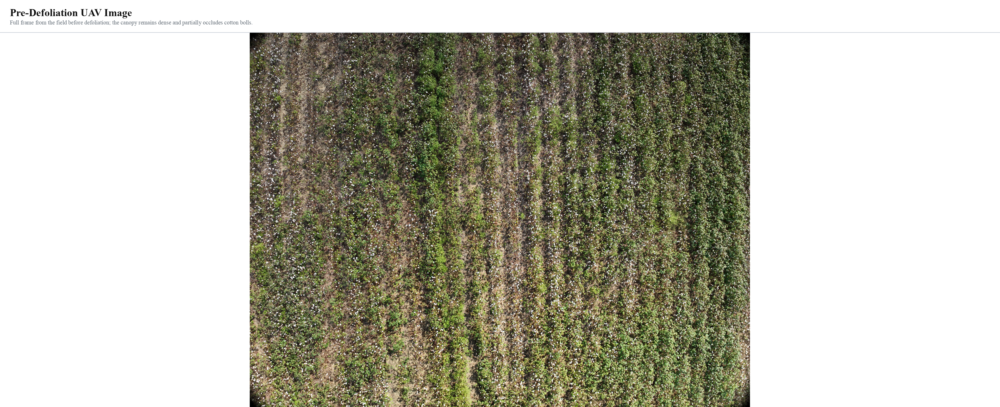

Full pre-defoliation frame from the ICML UAV dataset. The green canopy is intact, and cotton bolls remain partially occluded by leaves and dense vegetation.

## Slide 2: Pre-Defoliation Cotton Response Map

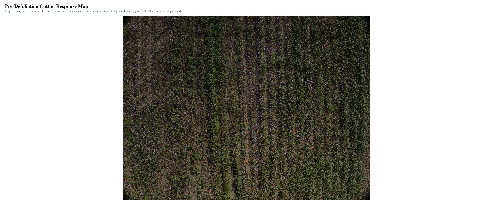

Cotton-only response map generated from cotton-boll candidate detections. The full image is preserved, and highlighted regions are restricted to detected cotton structures rather than the entire field.

## Slide 3: Post-Defoliation UAV Image

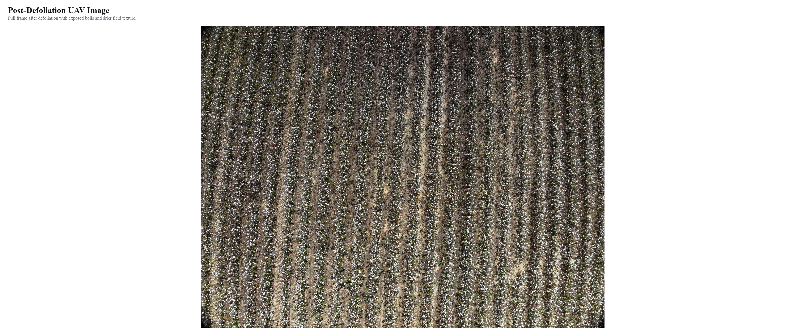

Full post-defoliation frame from the ICML UAV dataset. After defoliation, exposed cotton bolls and row structure become substantially more visible across the field.

## Slide 4: Post-Defoliation Cotton Response Map

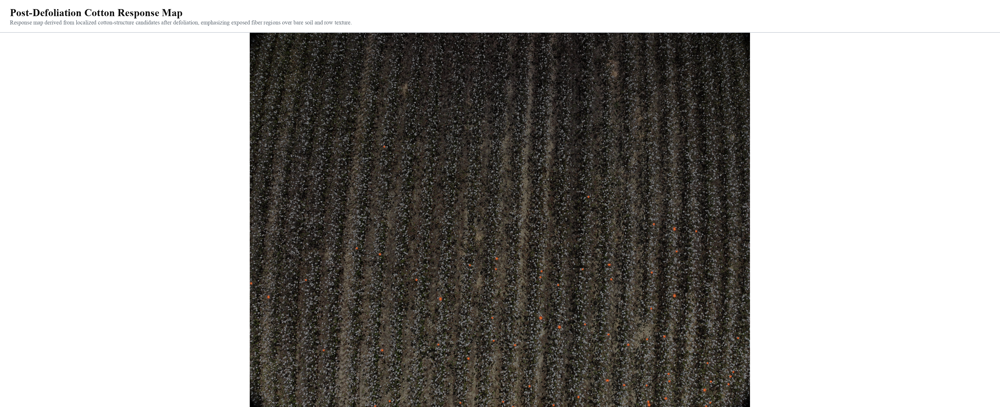

Cotton-only response map generated from cotton-boll candidate detections. Highlighted regions correspond to detected cotton structures and reveal the denser exposed cotton distribution after defoliation.

## Slide 5: Pre-defoliation scene analysis

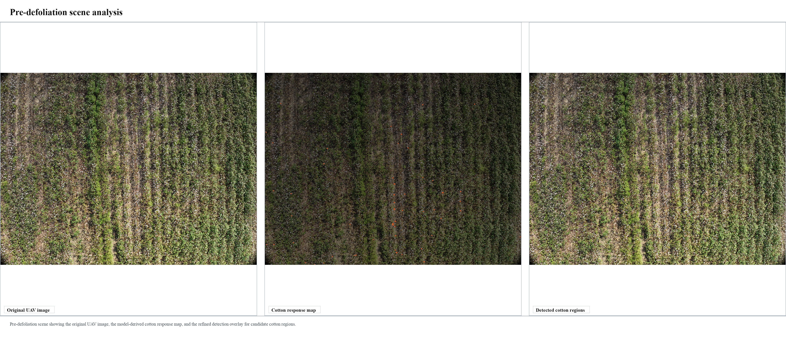

Pre-defoliation scene showing the original UAV image, the model-derived cotton response map, and the refined detection overlay for candidate cotton regions.

## Slide 6: Post-defoliation scene analysis

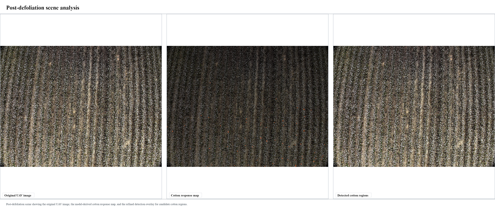

Post-defoliation scene showing the original UAV image, the model-derived cotton response map, and the refined detection overlay for candidate cotton regions.

## Slide 7: Cross-Validation Bars

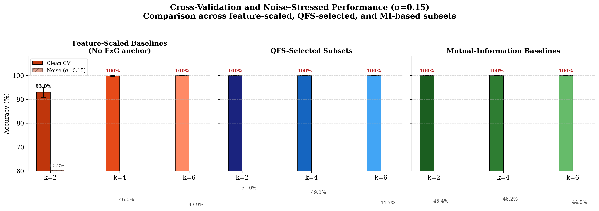

Cross-validation accuracy and noise-stressed accuracy across the compared feature families at k=2, 4, and 6. The slide summarizes baseline behavior before the remaining stress tests.

## Slide 8: Noise Robustness Curve

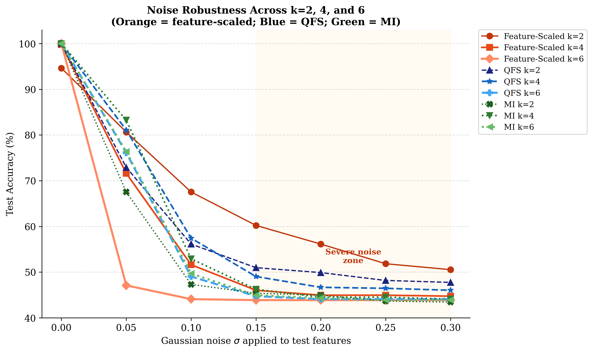

Accuracy under progressively stronger Gaussian noise. This figure is useful for the demo because it emphasizes robustness rather than clean-data performance alone.

## Slide 9: Augmentation Robustness Matrix

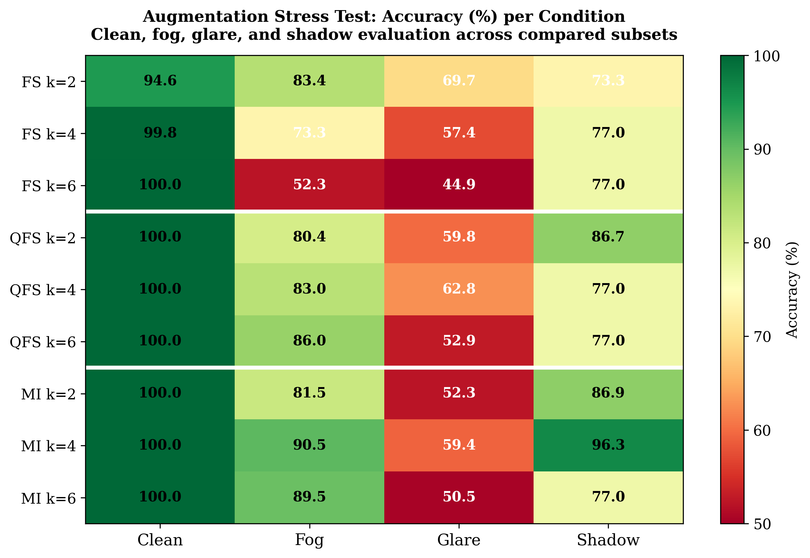

Performance under clean, fog, glare, and shadow conditions. The matrix compactly summarizes how each feature family behaves under major field perturbations.

## Slide 10: ROC and Precision-Recall Curves

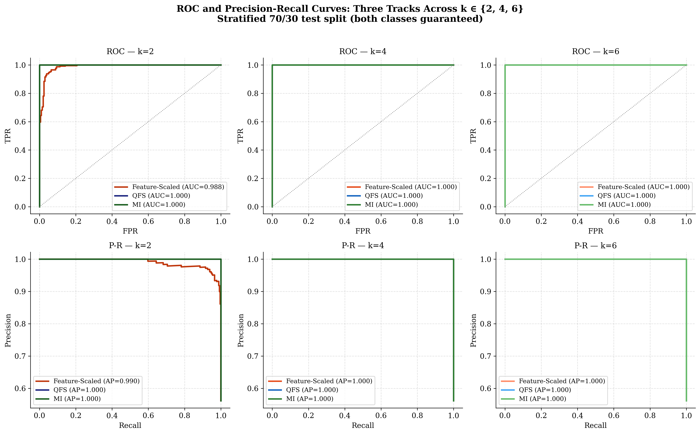

ROC and precision-recall curves provide threshold-free comparisons across the k-based subsets and show how ranking quality varies between the candidate feature families.

## Slide 11: Feature Membership Map

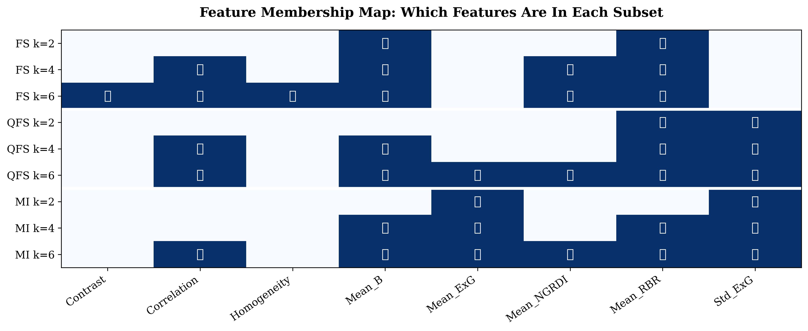

Binary feature-membership map for the compared subsets. This makes the selected descriptors transparent without interrupting the video with long tables.

## Slide 12: Summary Table

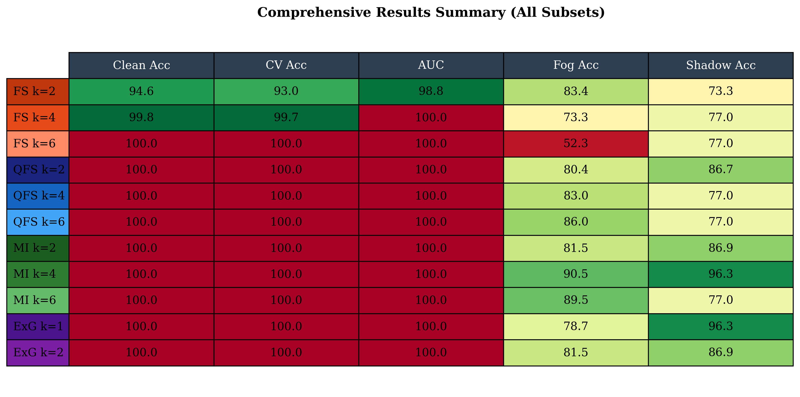

Compact summary of the key results used in the k-comparison study. This slide acts as a bridge from the main comparison plots to the reproduced figures that follow.

## Slide 13: Cross-Validation Stability

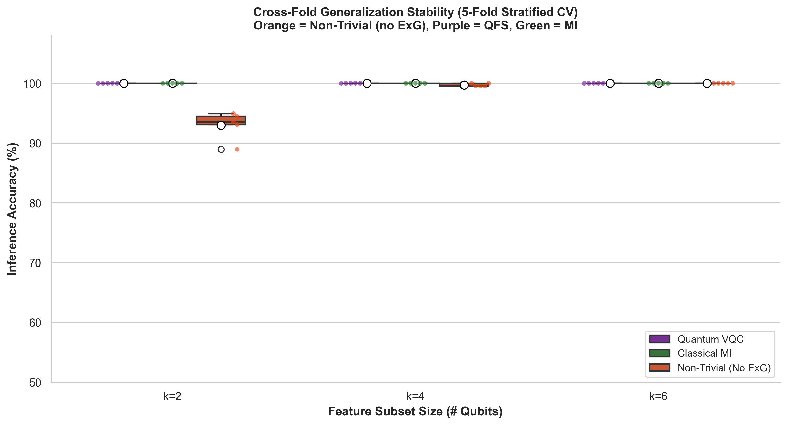

Cross-validation stability across folds. The boxplot complements the bar chart by exposing variance rather than only central tendency.

## Slide 14: Qubit Scaling Comparison

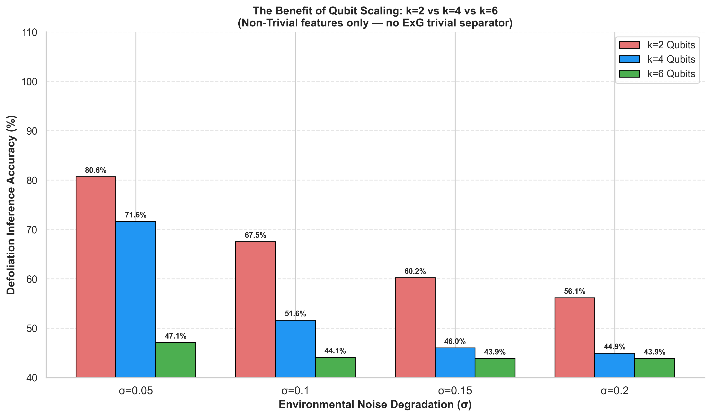

Performance trend as the selected subset size increases from k=2 to k=6. This plot connects the feature-selection story to the quantum subset size directly.

## Slide 15: PCA Manifold View

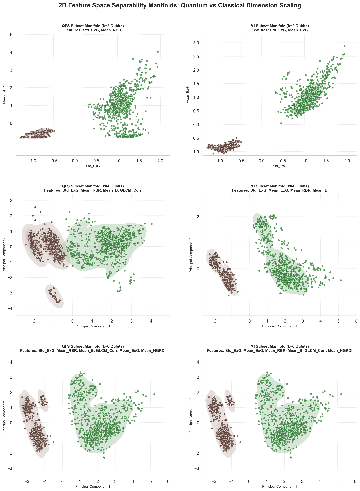

Low-dimensional manifold view of the selected feature representations. It helps visualize the separation structure learned by the compared subsets.

## Slide 16: Multi-Metric Radar Summary

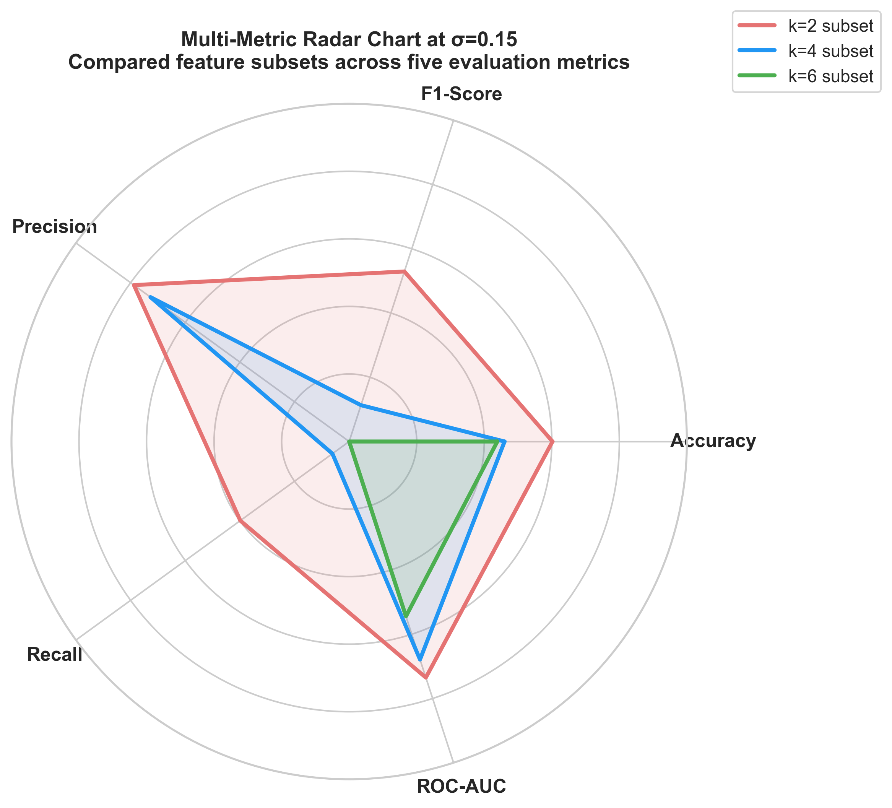

Multi-metric summary at sigma = 0.15 using accuracy, F1-score, precision, recall, and ROC-AUC. The labels were rewritten for the demo to keep the presentation neutral and academically consistent.
